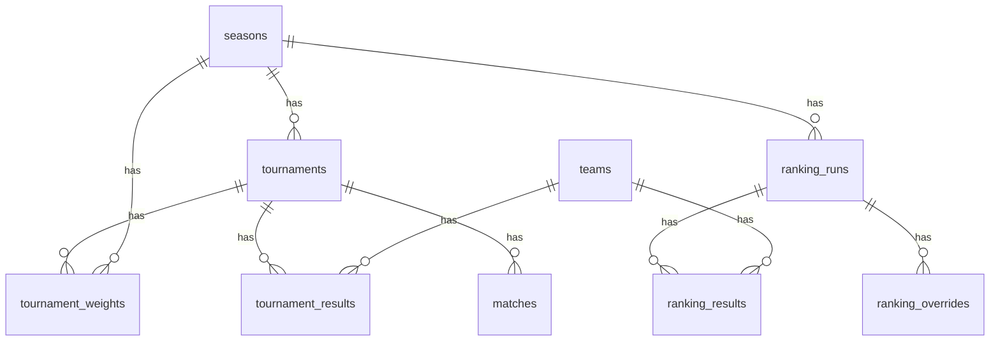

# Volleyball Ranking Engine

A web application that computes, reviews, and exports team rankings for AAU volleyball across four age groups (15U, 16U, 17U, 18U) using a five-algorithm ensemble approach.

Built for the AAU ranking committee to import tournament data, run transparent multi-perspective rankings, apply committee overrides, and export final results.

## How It Works

The engine runs five independent rating algorithms on every ranking computation:

| Algorithm     | Method                           | Characteristic                             |
| ------------- | -------------------------------- | ------------------------------------------ |
| Colley Matrix | Solves Cr=b via LU decomposition | Time-independent, treats all games equally |
| Elo (2200)    | Chronological with K=32          | Lower starting baseline                    |
| Elo (2400)    | Chronological with K=32          | Mid-low starting baseline                  |
| Elo (2500)    | Chronological with K=32          | Mid-high starting baseline                 |
| Elo (2700)    | Chronological with K=32          | Higher starting baseline                   |

Each algorithm's output is normalized to a 0-100 scale, then averaged into an **Aggregate Rating**. Teams are ranked by aggregate rating with alphabetical tie-breaking. Tournament weights allow the committee to scale the importance of individual tournaments across all algorithms.

This ensemble approach produces rankings that are defensible, transparent, and resilient to the biases of any single method.

## Features

- **Data Import** -- Upload XLSX spreadsheets with tournament finishes or pre-computed Colley ratings. Two-phase workflow (preview then confirm) with fuzzy team name matching.
- **Ranking Computation** -- Run all five algorithms in a single operation. Results include per-algorithm breakdowns so the committee can see where teams agree or diverge.
- **Tournament Weights** -- Adjust multipliers (0.0-5.0) per tournament to reflect prestige and competition level.
- **Committee Overrides** -- Move teams to specific rank positions with required justification and attribution.
- **Run Finalization** -- Lock ranking runs to prevent further modification, preserving the official record.
- **Export** -- Download rankings as CSV, XLSX, or PDF with optional algorithm breakdowns and override summaries.
- **Multi-Age-Group** -- Each age group (15U, 16U, 17U, 18U) operates as a fully independent dataset.
- **Team Detail** -- Drill into any team to see algorithm breakdown, tournament history, and head-to-head records.

## Tech Stack

| Layer      | Technology                     |
| ---------- | ------------------------------ |
| Framework  | SvelteKit 2.50 (Svelte 5)      |
| Language   | TypeScript 5.9                 |
| Styling    | Tailwind CSS 4.2               |
| Database   | Supabase (PostgreSQL)          |
| Validation | Zod 4.3                        |
| Testing    | Vitest 4.0 (180 tests)         |
| Math       | ml-matrix (Colley), custom Elo |
| Export     | jspdf, xlsx                    |

## Quick Start

```bash
# Clone
git clone https://github.com/nino-chavez/volleyball-ranking-engine.git
cd volleyball-ranking-engine

# Install
npm install

# Configure environment
cp .env.example .env
# Edit .env with your Supabase project URL and keys:
#   PUBLIC_SUPABASE_URL=https://your-project.supabase.co
#   PUBLIC_SUPABASE_PUBLISHABLE_DEFAULT_KEY=your-anon-key
#   SUPABASE_SERVICE_ROLE_KEY=your-service-role-key

# Apply database migrations
npx supabase db push

# Start development server
npm run dev
```

Open [http://localhost:5173](http://localhost:5173).

### Verify Setup

```bash
# Run all tests
npx vitest run

# Type check
npm run check
```

## Project Structure

```
volleyball-ranking-engine/
├── src/
│   ├── lib/
│   │   ├── ranking/          # Core algorithms (Colley, Elo, normalization)
│   │   ├── import/           # XLSX parsing, identity resolution
│   │   ├── export/           # CSV, XLSX, PDF generation
│   │   ├── schemas/          # Zod validation schemas
│   │   ├── components/       # Svelte 5 UI components
│   │   └── types/            # Auto-generated database types
│   └── routes/
│       ├── api/              # REST API endpoints
│       │   ├── import/       #   Upload and confirm
│       │   └── ranking/      #   Run, results, overrides, weights, team
│       ├── import/           # Import page
│       └── ranking/          # Dashboard, weights, team detail
├── supabase/
│   └── migrations/           # 15 PostgreSQL migrations
├── tests/                    # Integration tests
├── docs/                     # Comprehensive documentation
└── CLAUDE.md                 # Project configuration
```

## Database Schema

9 tables with 2 RPC functions and 2 custom enums:



## API Endpoints

| Method          | Endpoint                         | Purpose                                 |
| --------------- | -------------------------------- | --------------------------------------- |
| POST            | `/api/import/upload`             | Parse XLSX, return preview              |
| POST            | `/api/import/confirm`            | Commit import to database               |
| POST            | `/api/ranking/run`               | Execute ranking computation             |
| GET             | `/api/ranking/results`           | Get results for a run                   |
| GET             | `/api/ranking/runs`              | List runs (filter by season, age group) |
| POST            | `/api/ranking/runs/finalize`     | Lock a run                              |
| GET/PUT         | `/api/ranking/weights`           | Tournament weight management            |
| GET/POST/DELETE | `/api/ranking/overrides`         | Committee overrides                     |
| GET             | `/api/ranking/team/[id]`         | Team detail with breakdown              |
| GET             | `/api/ranking/team/[id]/h2h`     | Head-to-head records                    |
| GET             | `/api/ranking/team/[id]/history` | Rank history across runs                |

## Documentation

Comprehensive documentation is available in [`docs/`](docs/):

| Layer                              | Description                           | Entry Point                                 |
| ---------------------------------- | ------------------------------------- | ------------------------------------------- |
| [Architecture](docs/architecture/) | System design, ADRs, diagrams         | [Overview](docs/architecture/README.md)     |
| [Developer](docs/developer/)       | Setup, contributing, onboarding       | [Dev Guide](docs/developer/README.md)       |
| [Testing](docs/testing/)           | Strategy, patterns, coverage          | [Testing Strategy](docs/testing/README.md)  |
| [Functional](docs/functional/)     | Business rules (non-technical)        | [Specifications](docs/functional/README.md) |
| [Strategic](docs/strategic/)       | Health assessment, tech debt, roadmap | [Assessment](docs/strategic/README.md)      |
| [Operations](docs/ops/)            | Deployment, infrastructure, runbooks  | [Ops Guide](docs/ops/README.md)             |
| [User Guide](docs/user/)           | Tutorials, how-to guides, reference   | [User Docs](docs/user/README.md)            |

## Architecture

```
Browser (SvelteKit Pages + Components)
    │
    ├── fetch() ──► API Routes (11 endpoints)
    │                    │
    │                    ├── RankingService ──► Colley Matrix
    │                    │                 ──► Elo (x4 variants)
    │                    │                 ──► Normalizer
    │                    │
    │                    ├── ImportService ──► Parsers
    │                    │                ──► IdentityResolver
    │                    │
    │                    └── Zod Schemas ──► Supabase Client
    │                                            │
    └── Export Module (CSV, XLSX, PDF)      PostgreSQL (9 tables)
```

See [Architecture Overview](docs/architecture/README.md) for detailed diagrams and decision records.

## License

MIT
